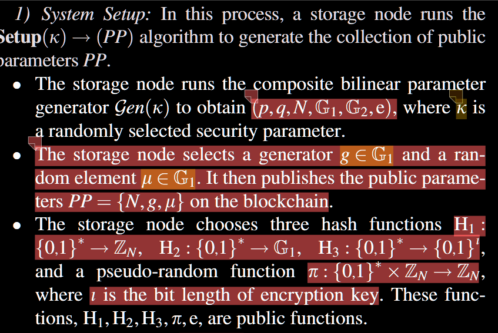

# 函数修改意见

## 系统初始化函数

### 输入参数

控制台输入 安全参数K

### 输出参数（公共参数）

N = p*q

g是G_1的一个生成元

$\mu$是G_2的一个生成元

### 输出结果

输出到指定的目录文件为json文件，只需要这几个输出参数即可。

不需要额外的信息。

### 写一个加载public_params函数与保存public_params函数

### 另外保存p,q,N,G_1,G_2,e作为public_fuinction.json

The
